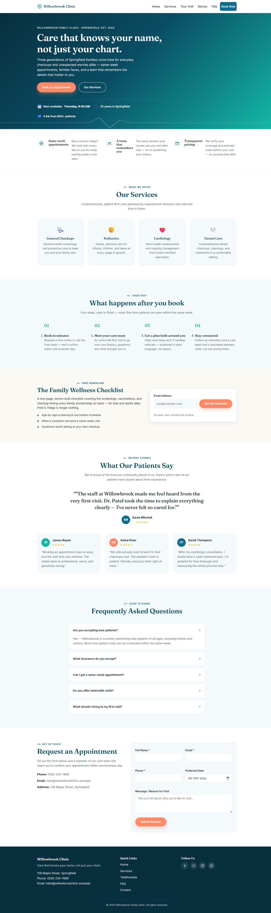

# Willowbrook Family Clinic

A static, single-page marketing site for a healthcare clinic — hero, value props, services, a patient care-journey walkthrough, a downloadable lead-magnet checklist, testimonials, an FAQ, an appointment enquiry form, and a floating WhatsApp chat widget.

**Live site:** https://patecclaudeshare.github.io/Healthcare/

## Tech stack

No framework, no build step, no package manager — just three hand-written files:

- `index.html` — all markup
- `styles.css` — all styling
- `script.js` — all behavior

## Running locally

Open `index.html` directly in a browser (double-click, or `Start-Process index.html` on Windows). There is no dev server, bundler, or test suite — changes are visible on a page refresh.

## Project structure

The three files are organized into parallel, numbered sections with matching HTML comment headers (e.g. `<!-- ===== HERO SECTION ===== -->` in HTML corresponds to `/* 3. HERO SECTION */` in CSS). When editing a section, check all three files for the corresponding block.

`index.html`, top to bottom: navbar → hero → value props (`#why`) → services → care journey (`#journey`) → lead-magnet checklist (`#checklist`) → testimonials → FAQ (`#faq`) → enquiry/contact form (`#contact`) → footer → floating WhatsApp widget. Nav links and the hero's CTA buttons anchor-link to section IDs; smooth scrolling is done via CSS `scroll-behavior: smooth`, not JS. `<head>` also carries Open Graph/Twitter meta tags and JSON-LD structured data (`MedicalClinic` + `FAQPage`).

`styles.css`:
- CSS custom properties for the color palette and shared tokens live under `:root` (`--color-primary`, `--color-accent`, etc.) — change the palette there, not per-component.
- Mobile-first, with `min-width` breakpoints at `640px`, `768px`, and `1024px` added per-section as needed.
- `.fade-in` is a generic scroll-reveal class applied across every section, driven by the `IntersectionObserver` in `script.js`.

`script.js`: mobile nav toggle, scroll fade-in (`IntersectionObserver`), enquiry form validation/submission, the next-available-appointment hero chip, the lead-magnet checklist form (validates an email, then triggers a local text-file download), footer year injection, and the floating WhatsApp widget's open/close behavior. The enquiry form's `fields` object is the single place field-level validators and error messages are defined.

The enquiry form submits to [Web3Forms](https://web3forms.com/) via `fetch()` (access key set as `WEB3FORMS_ACCESS_KEY` in `script.js`), showing a success or error banner based on the response. The lead-magnet checklist form doesn't POST anywhere yet — on successful validation it `console.log`s the email and triggers a local file download; there's a marked comment block showing where a real API call would go.

The floating WhatsApp widget (bottom-right) is a pulsing button that opens a panel with a few suggested quick-reply questions and a direct chat CTA, both linking to `wa.me/<number>` with a pre-filled message. The number is hardcoded in `index.html`.

`robots.txt` and `sitemap.xml` at the repo root support search-engine discoverability.

## Deployment

Pushes to `main` are automatically deployed to GitHub Pages via the workflow in [`.github/workflows/deploy.yml`](.github/workflows/deploy.yml).
